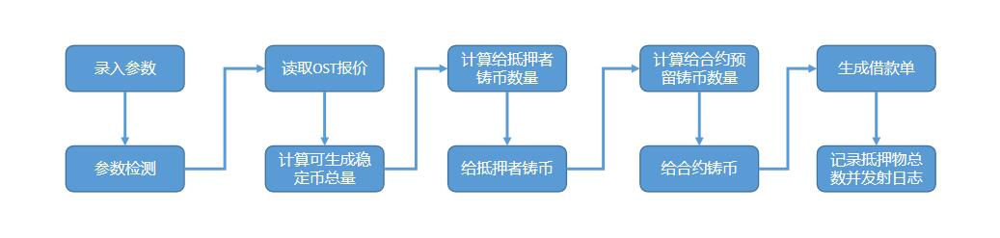
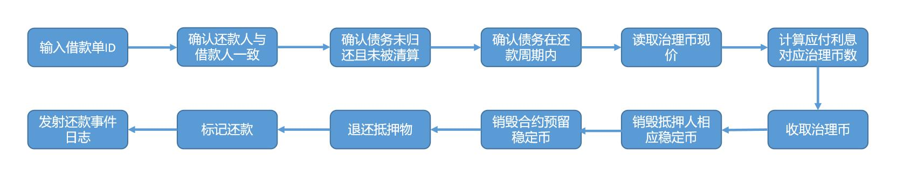
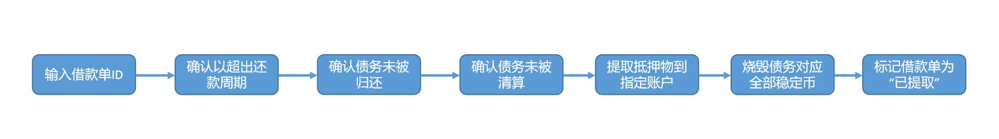
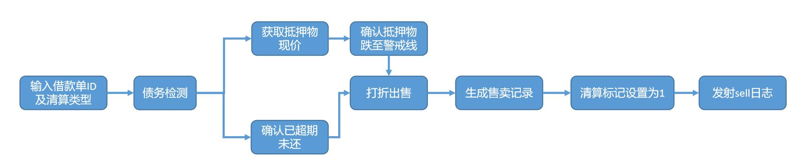

# mortgage合约

## pledge方法

pledge方法根据抵押物品数量以及抵押物现价生成等值的FAN稳定币。

方法将按抵押率分配稳定币。

例：假设借款人抵押价值100usd的抵押物品到合约，且当前抵押率为80%

则：80个FAN将分配给借款人，同时20个FAN保留在合约中

## repayment方法

repayment方法支持用户归还稳定币并赎回抵押物。

输入借款单ID，合约首先检查借款单的正确性，如还款人与借款人的一致性、债务未曾被清算、债务尚在还款周期内。

合约从预言机中读取治理币的现行价格，并计算应付利息，折合成治理币的价格。

用户在调用本方法前，需先行调用治理币合约的approve方法授权本合约有转移其相应数字资产的权利。系统前端将为用户计算出对应额度，由用户同意授权即可。

系统按借款单销毁还款人应归还的稳定币以及合约中预留的稳定币。然后退全部抵押物给用户。

最后将借款单标记为“已还款”并发射还款日志。

## withdraw方法

withdraw方法支持系统管理员对超时未归还的债务进行清理。

在销毁对应的稳定币的同时，回收抵押物品。

为确保安全，合约会根据借款单id检测该笔债务是否已超期，或债务未被清算。

债务中的抵押物品将会转移到指定账户中

## sell方法

sell方法支持对特定债务进行清理。

为防止系统资不抵债，系统设定资产债务比率以90%为警戒线。系统观察员（任意用户）在发现某笔债务因价格波动原因导致资产总价值下跌至警戒线时，可调用此函数，将该笔债务发起清算。

当某笔债务过期且未归还时，系统观察员可通过此函数触发清算。

系统将按照发给抵押人的稳定币数量为基准，降价5%对抵押物品进行售卖。

举例：抵押人抵押总价值100FAN的ost，系统发放80个FAN给抵押人，同时保留20个FAN在合约中。

当ost价格下跌导致抵押品总价值为88.8888个FAN时，该笔债务的警戒线比率跌至90%。此时触发清算，系统将以76的价格对外出售抵押物品。即80-80*5%的价格。当有购买者愿意出价76个FAN稳定币时，系统将全部抵押物发给购买者，同时销毁76+20个FAN稳定币。

## buy方法

buy方法支持购买者购买因清理而出售的抵押物。

本函数即销毁售卖标价的FAN稳定币，也销毁合约中曾经保留的FAN稳定币。

举例：抵押人抵押总价值100FAN的ost，系统发放80个FAN给抵押人，同时保留20个FAN在合约中。

当ost价格下跌导致抵押品总价值为88.8888个FAN时，该笔债务的警戒线比率跌至90%。此时触发清算，系统将以76的价格对外出售抵押物品。即80-80*5%的价格。

当有购买者愿意出价76个FAN稳定币时，系统将全部抵押物发给购买者，同时销毁76+20个FAN稳定币。

## reduction方法

reduction方法支持系统管理员下调抵押物售卖价格

下调价格时机，必须在调价周期之后。初始调价周期为3天，即开始售卖3天后方可降价销售。

每次调整价格后，会重置售卖开始时间。

## appreciation方法

appreciation方法支持系统管理员上调抵押物售卖价格

上调价格不受调价周期影响，但最高售卖价格不会超过抵押人获得的初始稳定币数量。

每次调整价格后，会重置售卖开始时间。